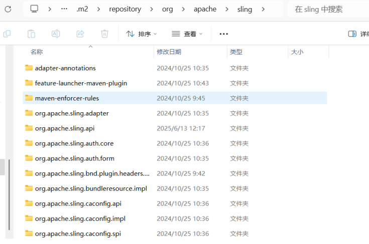
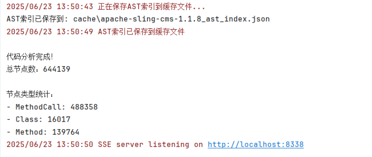
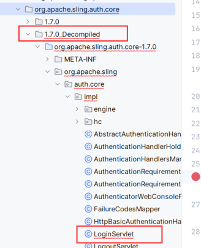
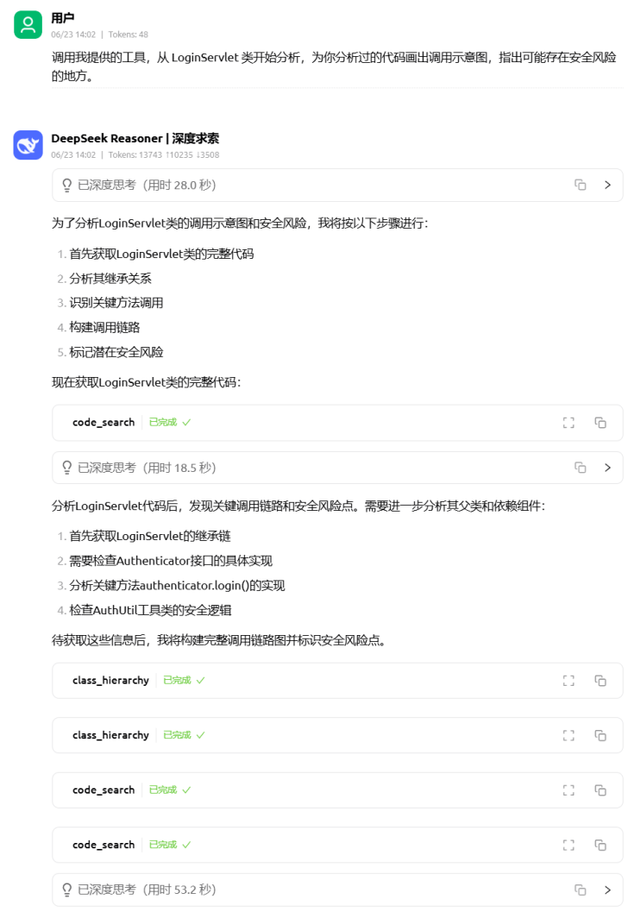
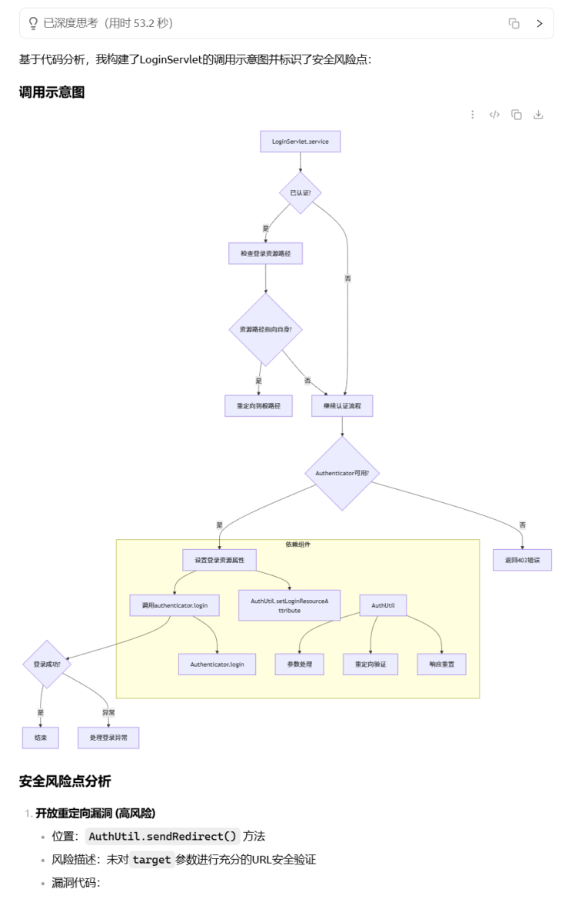
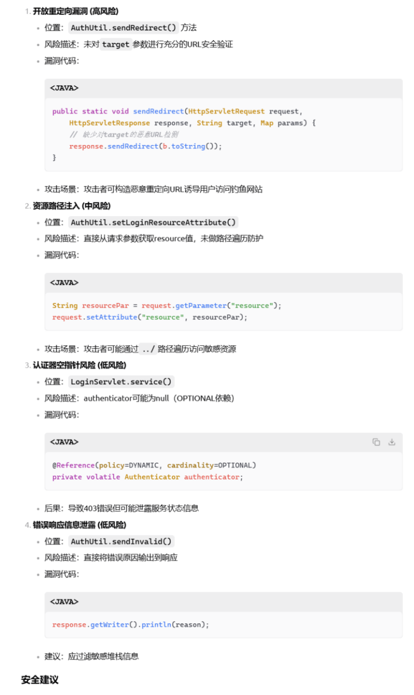
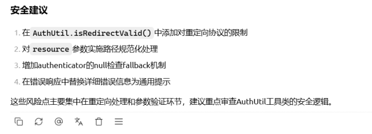

# Fenrir 代码审计工具

Fenrir 是一个基于 MCP 协议与 AST 技术的代码审计工具，旨在解决安全研究与自动化代码审计领域中，面对大规模、结构复杂甚至反编译代码时，传统代码搜索与分析手段效率低、准确性差的问题。

项目以 AST（抽象语法树）为核心，结合 MCP 协议和 go-tree-sitter 等先进技术，实现了对 Java 等语言源码的结构化解析、索引与高效检索。其主要功能包括：基于 AST 的类、方法、字段、父类、子类等精准代码段搜索，AST 索引的持久化缓存，MCP 协议下的智能工具注册与 AI 协作，以及对反编译代码的良好兼容性。项目创新点在于将 AST 结构与 AI 智能对话深度融合，极大提升了大模型在代码安全分析场景下的实用性和智能性。整体架构模块化、易扩展，适合集成到更大的自动化安全平台，具有很高的工程实用价值和行业推广前景。

## 功能特性

### 1. AST 抽象语法树
本工具实现代码搜索功能的核心原理是为代码构建 AST 抽象语法树。

### 2. 代码结构分析
基于 AST 语法树实现对于类、方法、属性、父类、子类精确的代码段查找功能，使大模型能够准确的搜索到自己想要的代码段。众所周知，使用 MCP 协议一个很大的痛点就是发送给大模型的上下文容易过长。此举能够剔除冗余信息，解决上下文过长的问题，也利于大模型更有效的做出判断。

### 3. MCP 协议
使用当下流行的 MCP 协议为 AI 赋能，通过提供功能强大的 MCP 工具，使得大模型能够与安全研究者站在相同的代码语境下平等对话，充分发挥 AI 的 “主观能动性” 。

### 4. 高效的 AST 缓存机制
支持AST索引的持久化缓存，避免每次分析都重复解析源码，大幅提升大项目的分析速度。缓存机制可配置，支持自动重建和手动清理。

## 安装说明

### 系统要求
- 构建版本为 Go 1.23.0 （如遇版本问题建议使用 Go 1.23.0 版本构建）
- 其它依赖参见 go.mod 文件
- 新版 go-tree-sitter 出现了不兼容问题 ：undefined: Node ，这是因为库代码中调用了 import "C" ，也就是开启了 cgo 支持。如果要用到 cgo（比如调用某些本地 C 库），需要在系统里装一个能被 Go 识别的 C 编译器，比如 MinGW-w64 。安装好后问题解决。

### 安装步骤

1. 克隆仓库
```bash
git clone https://github.com/yourusername/Fenrir-CodeAuditTool.git
cd Fenrir-CodeAuditTool
```

2. 安装依赖
```bash
go mod download
```

3. 编译项目
```bash
go build -o fenrir
```

## 使用方法

第一步，在 resources\config.yaml 文件中指定代码仓库路径，双斜杠。

第二步，双击运行项目根路径下的 fenrir-server.exe 文件，或者直接运行 application/server/main.go，启动 MCP 服务端。

第三步，使用 Cherry Studio 或其他客户端工具配置此 MCP 服务器，配置大模型 API 密钥，即可开始对话使用。（大模型的 API 密钥需要自行购买）。

注：你可以在 cache 目录下查看对应代码仓库的 AST 缓存文件。

## 项目结构

```
Fenrir-CodeAuditTool/
├── application/            # 服务端启动程序，包含 MCP 工具与提示词注册
├── cache/                  # AST 缓存文件目录
├── configs/                # 配置程序
├── docs/                   # 演示图片
├── internal/               # AST 解析核心程序
├── prompts/                # 代码审计提示词
├── resources/              # 配置文件
├── test/                   # 测试程序
└── tools/                  # 缓存文件管理程序
```

## 实机演示

选择 Apache 开源项目 Sling CMS 作为待审计的项目，项目地址： https://github.com/apache/sling-org-apache-sling-app-cms

导入 maven 依赖，在本地仓库中找到 sling 的依赖，比如我这里的路径是：C:\Users\miaoj\.m2\repository\org\apache\sling：



这些依赖中包含着 Sling CMS 的核心代码，需要全部反编译并将反编译后的代码复制到代码仓库。

完成上述步骤后，指定代码仓库为 Sling CMS 的项目根路径，运行服务端代码，开始为代码仓库构建 AST 索引并保存到缓存文件，并开启一个 SSE 监听：



使用 Cherry Studio 作为 MCP 客户端连接此服务器，下面我们让 Deepseek 从登录逻辑 LoginServlet 处开始分析，LoginServlet 位于依赖 org.apache.sling.auth.core 反编译后的代码中：



来看看大模型的表现：









- 首先，我们能够看到对于 Apache Sling CMS 这样的大型项目也能够正确地进行 AST 解析。 

- 其次，反编译的代码也能被正确解析并被查找到。 

- 再次，deepseek 画出了调用图展示了其链式调用的过程，体现了本工具自动化链式查找并分析的强大功能。 

- 最后，deepseek 指出了存在安全风险的代码段并给出了修复建议，完成了代码审计。

## 温馨提示

- 目前仅支持对 Java 代码构建 AST 索引（包括反编译代码）
- 实际审计效果依赖于大模型的能力
- 实际使用时应当有目的的对提示词进行微调


## 贡献指南

1. Fork 项目
2. 创建特性分支 (`git checkout -b feature/AmazingFeature`)
3. 提交更改 (`git commit -m 'Add some AmazingFeature'`)
4. 推送到分支 (`git push origin feature/AmazingFeature`)
5. 创建 Pull Request

## 许可证

本项目采用 Apache 2.0 许可证 - 详见 [LICENSE](LICENSE) 文件


## 致谢

- [Tree-sitter](https://tree-sitter.github.io/tree-sitter/) - 用于代码解析
- [Go AST](https://golang.org/pkg/go/ast/) - Go 语言 AST 支持
- [Java Parser](https://github.com/smacker/go-tree-sitter-java) - Java 语言解析支持 